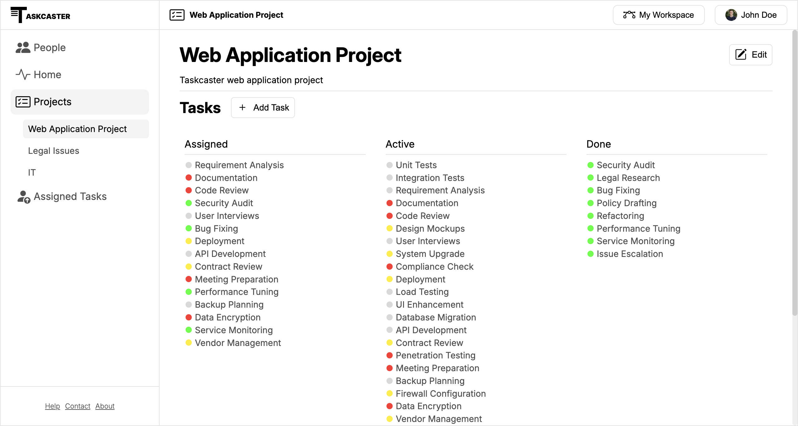
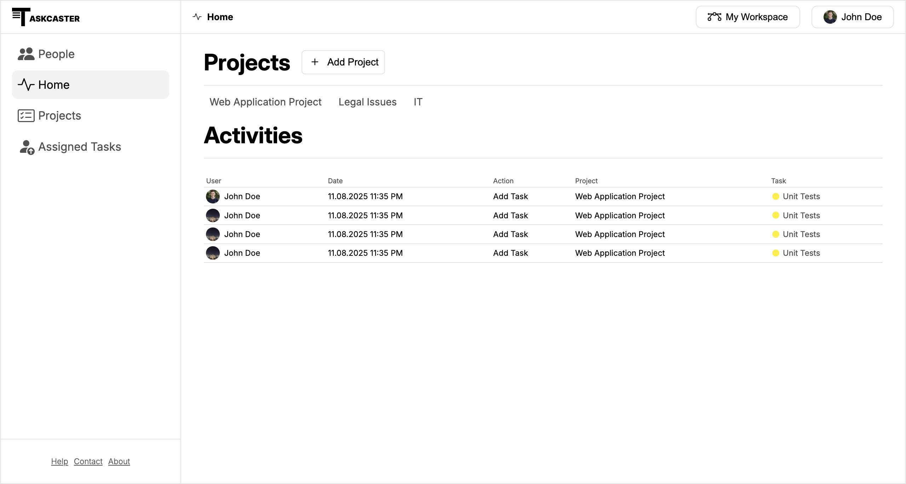
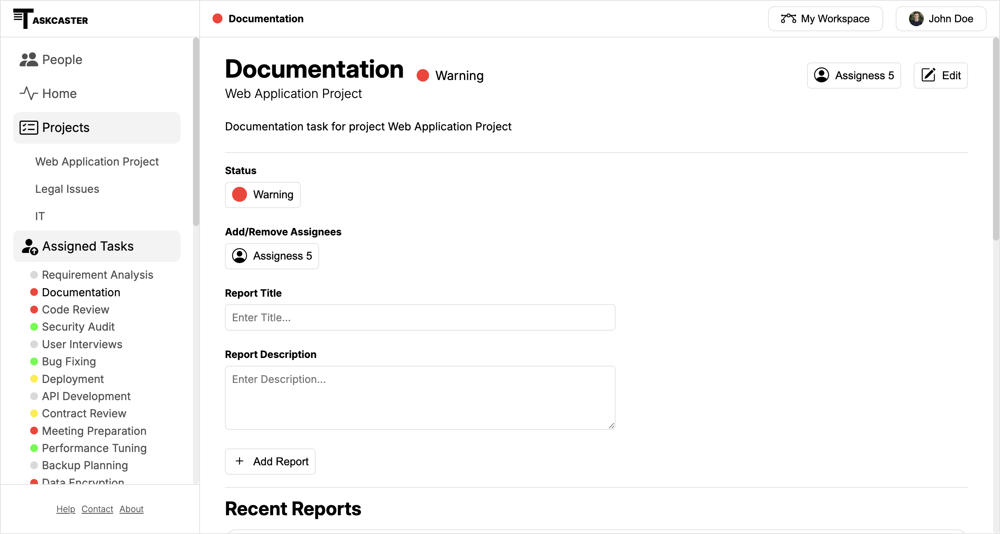

  

# Taskcaster: A Collaborative Task Management App

Taskcaster is an app with a clear goal: enabling collaboration through project and task management.

> [!NOTE]
> This project is still in development.
> Currently, some parts of the frontend demo are visible and functional.

## Getting Started

1. Clone the repository
2. Open panel.html in your browser to view the current frontend demo

## Roadmap

Current focus:

- Frontend development to test and improve the UI design

Soon:

- Backend development with Express and TypeScript

## Tech Stack

**Frontend :** Currently, the frontend is developed using plain HTML, CSS and JavaScript files.
These files are sent to the client as is. This approach may change in the future.

**Backend :** The goal is to develop a backend app with Express and TypeScript.

## Demo

Home page

## 

Task page

## 
